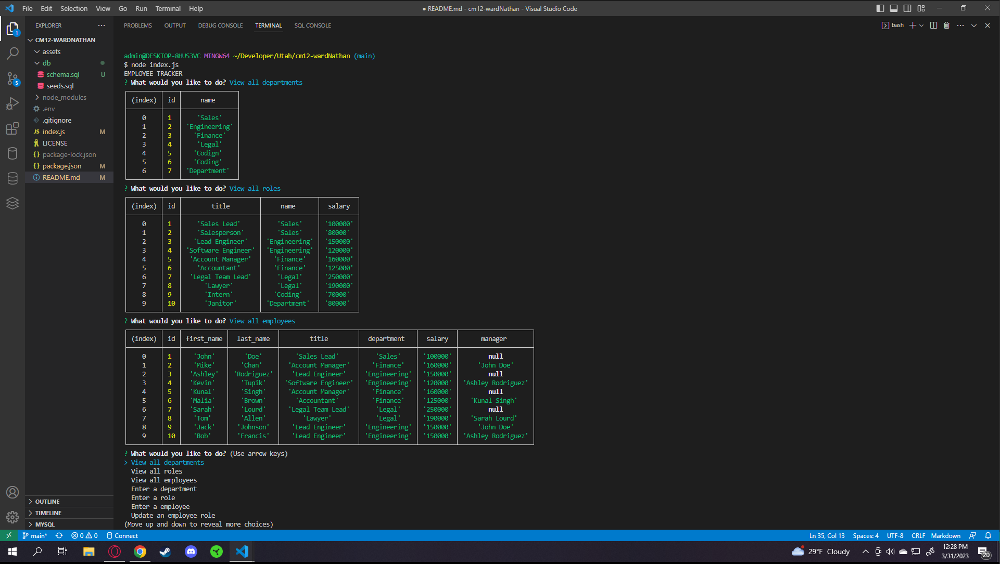

# Employee tracker

## Description

I wanted a program that allowed me to to track and add an employee and also keep track of their department, role, and salary. It also allows their roles to be changed or updated.

## Installation

For the program to operate the user must insert the following into their command line:
npm i inquirer@8.2.4
npm i mysql
npm install --save mysql2
npm i dotenv
npm install nodemon

## Usage

To use the program insert the following into the command line:
node index.js

and follow the prompts

## Credits

N/A

## Tests

N/A

## Links and Images

https://github.com/wardNathan/cm12-wardNathan
https://drive.google.com/file/d/1XF65R3IQtMdh5vQI01gln5VpOEhyiRIV/view
